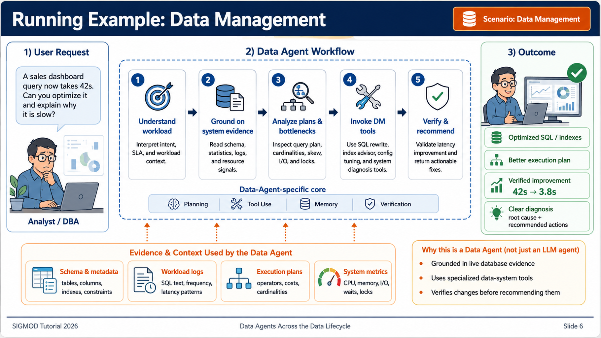
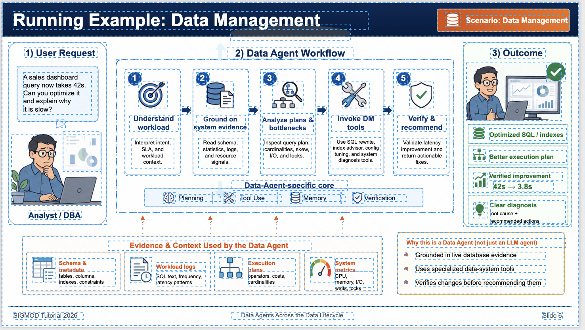
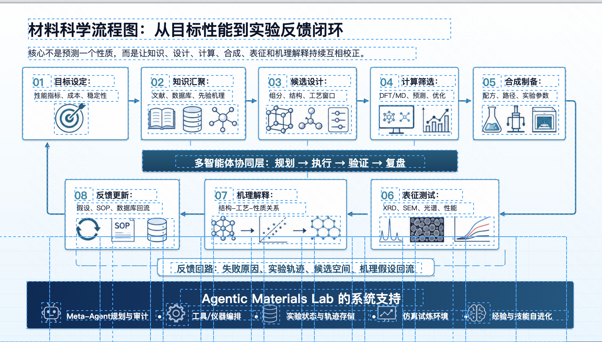

<div align="center">

# VCG-Bench

**A unified visual-centric benchmark for structured diagram generation and editing.**

[](https://arxiv.org/abs/2605.15677)
[](https://huggingface.co/datasets/sxy1620348809/VCG-Bench)
[](LICENSE)

[Paper](https://arxiv.org/abs/2605.15677) |
[Dataset](https://huggingface.co/datasets/sxy1620348809/VCG-Bench) |
[Data Card](DATA.md) |
[Citation](#citation)

</div>

VCG-Bench evaluates whether vision-language models can turn professional diagrams into executable, editable `mxGraph` XML and then edit that XML under natural-language instructions. It focuses on the diagram-as-code setting used by Draw.io / diagrams.net: outputs must be structurally valid, renderable, visually faithful, and practical to edit.

<div align="center">

</div>

## What This Repository Contains

This repository contains the code release for VCG-Bench:

| Path | Purpose |
|---|---|
| `configs/` | Prompt templates and runtime settings. |
| `src/` | Shared IO, rendering, model client, and processing code. |
| `eval/` | Task 1 and Task 2 evaluation pipelines and metrics. |
| `scripts/` | Data generation, rendering, viewers, utilities, and local model helpers. |
| `examples/` | Tiny runnable samples for smoke tests. |
| `docs/` | Setup notes for Draw.io, SigLIP, CodeVQA, and XDRFR. |
| `notebooks/` | Analysis notebooks used for benchmark reporting. |
| `assets/` | README figures and reconstruction case images. |

The full benchmark data is released separately on Hugging Face:

```text
https://huggingface.co/datasets/sxy1620348809/VCG-Bench
```

## Tasks

VCG-Bench defines two complementary tasks.

**Task 1: Vision-to-XML Generation**

Given a raster diagram image, a model generates a valid `mxGraph` XML string. The XML should parse, render, and preserve the visual layout, topology, text, and semantics of the source image.

**Task 2: Instruction-based XML Editing**

Given source `mxGraph` XML, its rendered image, and a natural-language edit instruction, a model predicts a structured patch. The patch is applied deterministically to produce the modified XML and rendered diagram.

Task 2 uses a JSON fragment replacement format:

```json
{
  "changes": [
    {
      "original_fragment": "<mxCell id=\"...\">...</mxCell>",
      "modified_fragment": "<mxCell id=\"...\">...</mxCell>"
    }
  ]
}
```

## Dataset

The public Task 1 release contains 1,449 diagram image samples across 6 coarse domains and 15 sub-domains. Each row contains a diagram image, domain labels, a structured visual description, and restored `mxGraph` XML when available.

| Split | Samples | Coarse domains | Sub-domains | Non-empty XML |
|---|---:|---:|---:|---:|
| `train` | 1,449 | 6 | 15 | 1,444 |

Load from Hugging Face:

```python
from datasets import load_dataset

ds = load_dataset("sxy1620348809/VCG-Bench", split="train")
sample = ds[0]

print(sample["image_id"])
print(sample["domain_l1"], sample["domain_l2"])
print(sample["image"])
print(sample["restored_xml"][:200])
```

See [DATA.md](DATA.md) for the exact schema, domain distribution, and local directory layouts expected by the evaluation scripts.

## Companion Skill

The companion `drawio-slide-reconstruction` skill packages practical instructions and helper scripts for reconstructing slide-style diagrams into editable Draw.io files with Codex or another coding agent. It is useful both as a reproducible case study for VCG-Bench and as a standalone workflow for diagram reconstruction.

The companion skill repository is prepared separately as `drawio-slide-reconstruction`. The public GitHub link will be added at release.

## Reconstruction Cases

The examples below show one-round Codex + skill reconstruction outputs. The left image is the original diagram, and the right image is the exported PNG from the reconstructed `.drawio` file.

<table>
  <tr>
    <th width="50%">Original</th>
    <th width="50%">Reconstructed Draw.io Export</th>
  </tr>
  <tr>
    <td></td>
    <td></td>
  </tr>
  <tr>
    <td></td>
    <td></td>
  </tr>
  <tr>
    <td></td>
    <td></td>
  </tr>
</table>

## Installation

Use Python 3.10+.

```bash
git clone https://github.com/<your-org-or-user>/VCG-Bench.git
cd VCG-Bench

python -m venv .venv
source .venv/bin/activate
pip install -r requirements.txt

cp .env.example .env
```

Set an OpenAI-compatible vision endpoint in `.env` when running model generation or VLM-based judging:

```bash
CUSTOM_API_KEY=your_api_key_here
CUSTOM_BASE_URL=https://your-endpoint/v1
CUSTOM_VISION_MODEL=gemini-3-pro-preview
```

The smoke tests below do not require an API key.

## Draw.io Setup

Draw.io Desktop/CLI is required when rendering XML to PNG and for execution-success metrics that render XML.

macOS:

```bash
brew install --cask drawio
```

Ubuntu/Debian:

```bash
sudo apt update
sudo apt install drawio
```

Linux without root access can use the Draw.io AppImage. See [docs/DRAWIO_LINUX_SETUP.md](docs/DRAWIO_LINUX_SETUP.md).

Verify local detection:

```bash
python - <<'PY'
from src.renderer.drawio_renderer import DrawioRenderer
r = DrawioRenderer()
print(r.drawio_path)
print("can_render=", r.can_render())
PY
```

If auto-detection fails, set `DRAWIO_PATH` in `.env`:

```bash
DRAWIO_PATH=/Applications/draw.io.app/Contents/MacOS/draw.io
```

## Smoke Tests

Run Task 1 evaluation on the bundled demo sample without any API call:

```bash
python eval/run_evaluation.py task1 \
  --benchmark examples/task1_demo \
  --output outputs/task1_demo_eval \
  --models gemini-3-pro-preview \
  --metrics execution_success_rate xml_token_count
```

Expected output files:

```text
outputs/task1_demo_eval/detailed_results.json
outputs/task1_demo_eval/all_models_comparison.csv
outputs/task1_demo_eval/all_models_summary_statistics.csv
```

Run Task 2 evaluation on the bundled no-op editing demo without any API call:

```bash
python eval/run_evaluation.py task2 \
  --benchmark examples/task2_demo \
  --output outputs/task2_demo_eval \
  --models gemini-3-pro-preview \
  --metrics modified_xml_execution_success_rate modified_xml_token_count modification_json_token_count xml_edit_distance
```

Expected output files:

```text
outputs/task2_demo_eval/detailed_results.json
outputs/task2_demo_eval/all_models_comparison.csv
outputs/task2_demo_eval/all_models_summary_statistics.csv
outputs/task2_demo_eval/all_models_by_instruction_difficulty.csv
```

## Single Image Generation

Generate a description and XML for one image:

```bash
python scripts/task1/process_single_image.py \
  examples/task1_demo/domain_management_domain_gantt/sample_0011/original.png \
  --provider custom \
  --model gemini-3-pro-preview \
  --output outputs/single_image_demo
```

Evaluate the generated XML with lightweight metrics:

```bash
python scripts/task1/evaluate_single_image.py \
  --output outputs/single_image_demo \
  --model gemini-3-pro-preview \
  --skip-render
```

`rendered.png` is produced when Draw.io is installed and generation is run without `--skip-render`.

## Batch Workflows

Prepare raw images under domain folders:

```text
data/raw_picture/
└── domain_example/
    └── image_001.png
```

Run Task 1 generation:

```bash
./task1.sh gemini-3-pro-preview \
  --source data/raw_picture \
  --target data/task1_benchmark \
  --skip-render \
  --skip-eval
```

Run lightweight Task 1 evaluation after model outputs exist:

```bash
python eval/run_evaluation.py task1 \
  --benchmark data/task1_benchmark \
  --output outputs/task1_eval \
  --models gemini-3-pro-preview \
  --metrics execution_success_rate xml_token_count
```

Task 2 generation and evaluation use the corresponding `task2.sh` and `scripts/commands/task2_*` entrypoints. See [scripts/root_entrypoints/README.md](scripts/root_entrypoints/README.md) for command wrappers used in larger runs.

## Evaluation Metrics

VCG-Bench reports execution, visual, and semantic metrics:

| Metric | Task | Purpose |
|---|---|---|
| ESR | Task 1 / Task 2 | Whether XML parses and renders successfully. |
| SCS | Task 1 / Task 2 | VLM-based style and layout consistency score. |
| CodeVQA | Task 1 | Semantic fidelity from XML-backed question answering. |
| SigLIP | Task 1 | Image embedding similarity between source and render. |
| XDRFR | Task 2 | XML-grounded decomposition requirement following rate. |
| Token / edit-distance metrics | Task 1 / Task 2 | Lightweight structural and cost diagnostics. |

SCS, CodeVQA, and XDRFR require API credentials for the judge model. SigLIP requires local model setup; see [docs/SIGLIP_SETUP.md](docs/SIGLIP_SETUP.md).

Token-count metrics use a deterministic character-length approximation by default so smoke tests run offline without downloading tokenizer files. Set `VCG_USE_TIKTOKEN=1` to use exact `tiktoken` counting when the tokenizer is available in your environment.

## Viewers

After local benchmark data exists:

```bash
./viewer.sh task1 review
./viewer.sh task2 review
```

These launch local Flask viewers for screening and reviewing generated samples.

## License

Code is released under the [MIT License](LICENSE). Dataset files are released under [CC BY 4.0](https://creativecommons.org/licenses/by/4.0/) unless the dataset card states otherwise.

## Citation

If you use VCG-Bench, please cite:

```bibtex
@misc{su2026vcgbenchunifiedvisualcentricbenchmark,
      title={VCG-Bench: Towards A Unified Visual-Centric Benchmark for Structured Generation and Editing}, 
      author={Xiaoyan Su and Peijie Dong and Zhenheng Tang and Song Tang and Yuyao Zhai and Kaitao Lin and Liang Chen and Gai Yuhang and Yuyu Luo and Qiang Wang and Xiaowen Chu},
      year={2026},
      eprint={2605.15677},
      archivePrefix={arXiv},
      primaryClass={cs.CL},
      url={https://arxiv.org/abs/2605.15677}, 
}
```
